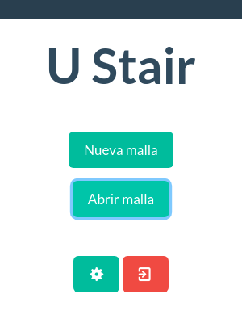
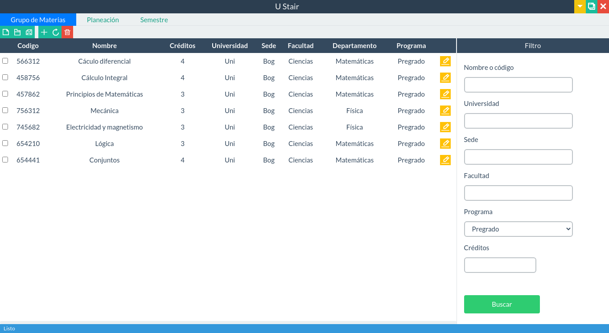
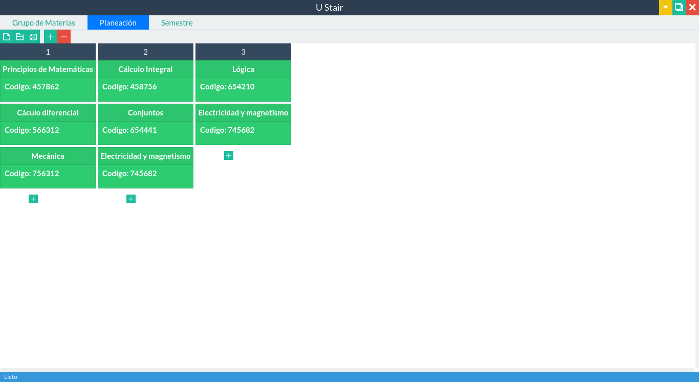
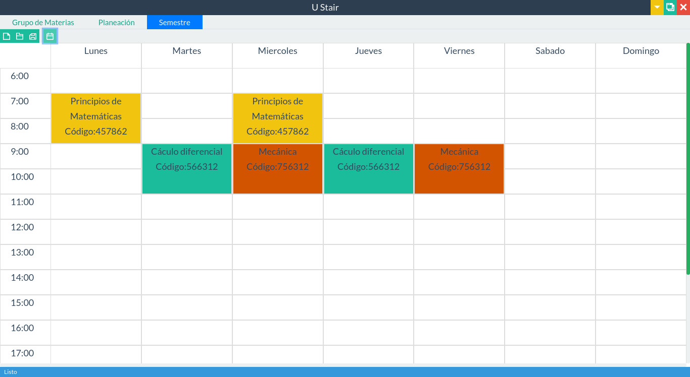

image:https://github.com/ritus2/U_Stair/workflows/Linux/badge.svg[]
image:https://github.com/ritus2/U_Stair/workflows/Windows/badge.svg[]
image:https://github.com/ritus2/U_Stair/workflows/Mac/badge.svg[]

= U Stair

Application for organizing the curriculum for university programs.

== Screenshots

